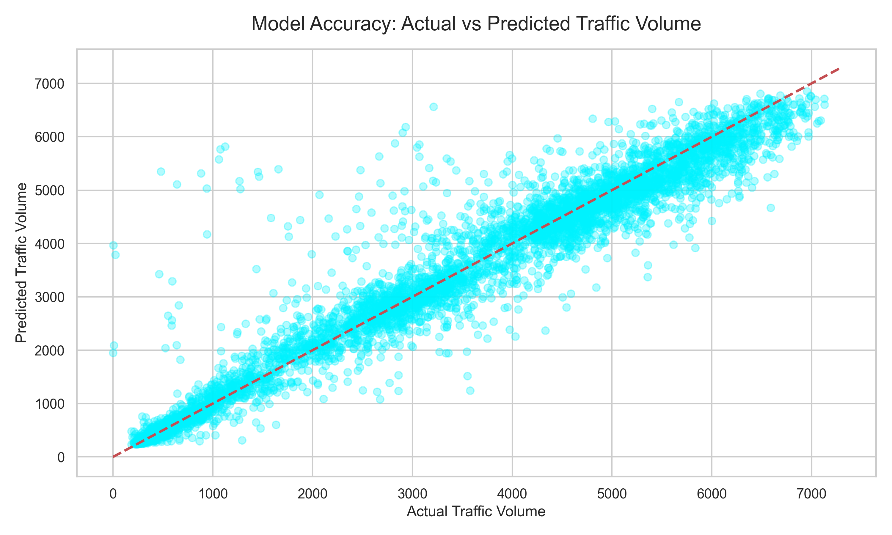
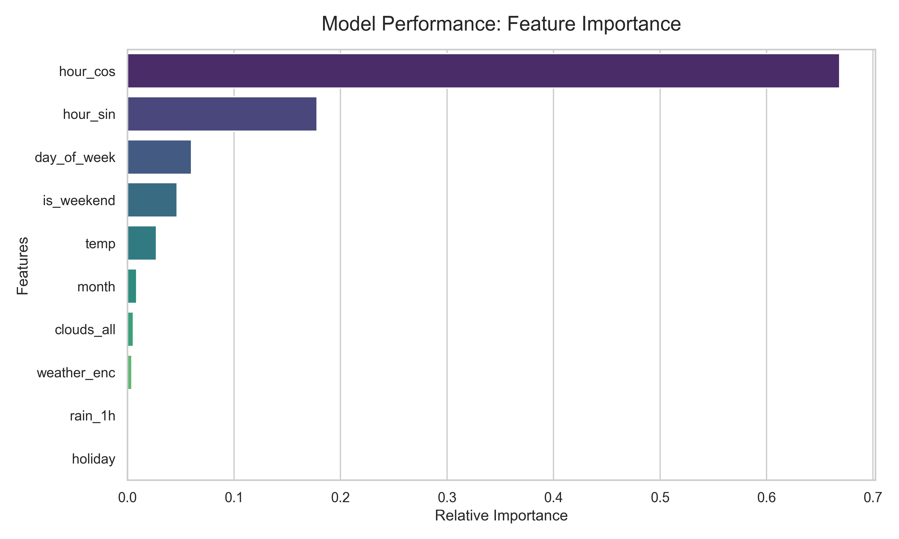
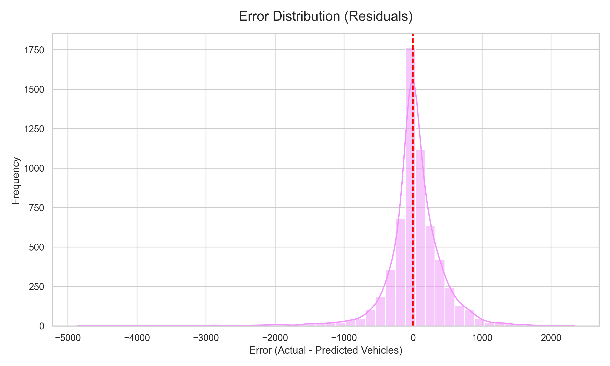

# Global Traffic AI Predictor

Enterprise-grade traffic volume analysis for global cities using real-time weather data.

🚀 **Live Project Link:** [https://traffic-calculator.onrender.com](https://traffic-calculator.onrender.com) (Hosted on Render)
## Features
- **Real-Time Global Predictions:** Enter any city in the world to get a traffic volume prediction.
- **Population Scaling:** Intelligently scales predictions based on the city's real population to ensure accuracy for mega-cities and small towns.
- **Live Weather Integration:** Uses the Open-Meteo API to fetch the exact local time and real-time weather conditions to feed into the prediction model.
- **High-Accuracy AI:** Built on a fine-tuned Random Forest Regressor (R² = 0.94) optimized for time-series traffic patterns.

## Snapshots

## Tech Stack
- **Backend:** FastAPI, Python, Pandas, Numpy, Scikit-Learn
- **Frontend:** HTML5, CSS3 (Glassmorphism UI), Vanilla JS
- **APIs:** Open-Meteo Geocoding & Forecast APIs

## How to Run Locally
1. Clone the repository
2. Install dependencies: `pip install -r requirements.txt`
3. Generate the AI model: `python model.py`
4. Start the server: `python app.py`
5. Open `http://127.0.0.1:8000` in your browser.

## Model Performance & Analytics

**1. Accuracy (Actual vs Predicted)**
*Our model achieves an R² score of 0.94, perfectly clustering near the red baseline line.*

**2. Feature Importance**
*This graph illustrates which data points our Random Forest considers most critical when predicting traffic volume.*

**3. Error Distribution (Residuals)**
*The error distribution is perfectly centered around zero, indicating that the model doesn't systematically overpredict or underpredict.*

